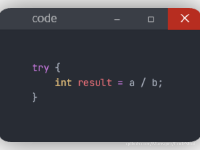
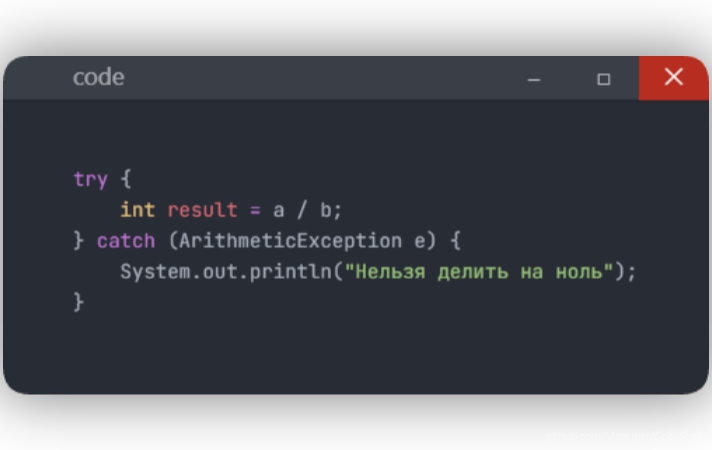
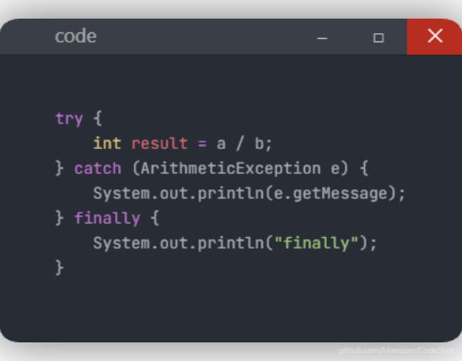
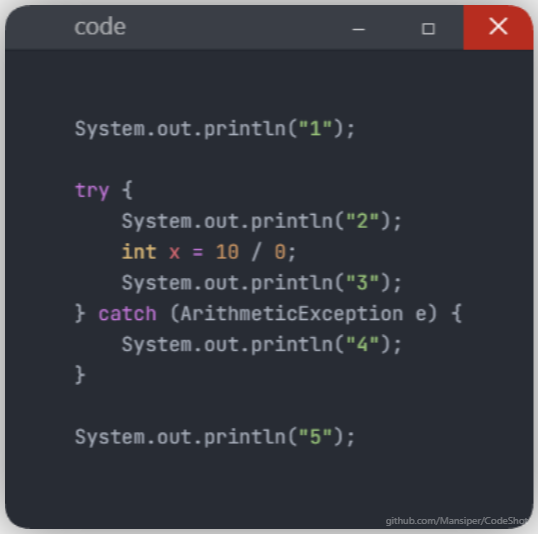

## 🚫 Исключения
### Исключение - это...
Объект, который представляет незапланированную или проблемную ситуацию, возникающие во время работы программы и прерывающие её нормальный ход.

Например, программа может столкнуться с ситуацией, которую невозможно нормально выполнить:

`int result = 10 / 0;`

При выполнении возникает исключение: `ArithmeticException`

То есть Java сообщает: Во время выполнения программы произошла исключительная ситуация.
### Зачем нужны исключения?
Представим: `int age = scanner.nextInt();`

Но пользователь написал: `abc`

Возникает: `NumberFormatException`

Без обработки программа может завершиться с ошибкой.

Механизм исключений позволяет сказать: Если во время выполнения этого участка произошла определённая ошибка - обработай её так.

## 🥊 `try`
### Опасный код помещается в `try`:

Мы как бы говорим: Попытайся выполнить этот код. Но одного `try` недостаточно.

## 🕸️ `catch`
### `catch` ловит исключение:

Поэтому программа может работать после обработки ошибки.

### Объект исключения.
В: `catch (ArithmeticException e)`

`e` - это объект исключения. Он содержит информацию о произошедшей ошибке.

Например: `e.getMessage()`

У исключения есть и другие методы, например:

`e.printStackTrace()` - показывает стек вызовов, который очень полезен при поиске места ошибки.

## 🏁 `finally`
### `finally` - блок, который используется для кода, который должен выполняться после `try/catch`:

Главная идея: `finally` используется для действий, которые нужно выполнить независимо от того, произошла ошибка или нет.

## ❓ Что происходит при исключении?
### Рассмотрим:

### Результат:
    1
    2
    4
    5   

Почему не выводится `3`?

Потому что при возникновении исключений Java прекращает обычное выполнение оставшихся функций внутри `try` и ищет подходящий `catch`
